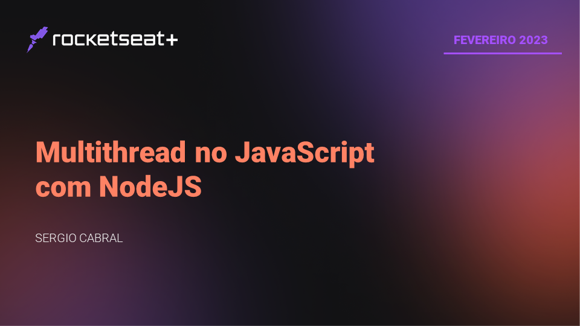
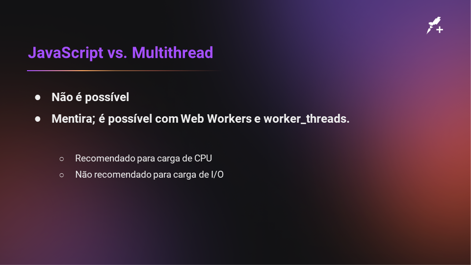

# Multithread no JavaScript com NodeJS

Esse repositório demonstra como usar trabalhos em multithread no NodeJS.

Como exemplificação, o código é um processo simples de mineração semelhante ao Bitcoin.

## Slides da aula

## Rocketseat+

|  |
| :-: |
|[sergiocabral.com](https://sergiocabral.com)|
